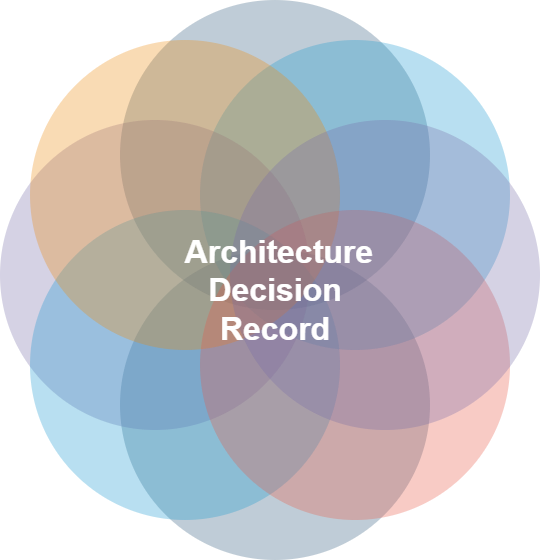

## Tabla de Contenidos

- [Tabla de Contenidos](#tabla-de-contenidos)
- [Objetivo](#objetivo)
- [Alcance](#alcance)
- [Architectural Decision Records](#architectural-decision-records)
    
## Objetivo

Documentación y Rastreo: El principal objetivo de un ADR es documentar de manera clara y concisa las decisiones arquitectónicas tomadas en el desarrollo de un sistema de software. Esto permite rastrear el por qué, el qué y el cuándo de cada decisión importante.

Comunicación: Facilitar la comunicación y la comprensión de las decisiones entre los miembros del equipo de desarrollo, así como con las partes interesadas, como los patrocinadores del proyecto.

Transparencia: Promover la transparencia en el proceso de toma de decisiones arquitectónicas, de modo que todos los involucrados tengan acceso a la información necesaria para entender y cuestionar las elecciones hechas.

## Alcance

Decisiones Arquitectónicas Relevantes: Los ADR se centran en decisiones arquitectónicas significativas que afectan la estructura, diseño y comportamiento del sistema de software. Estas decisiones suelen ser críticas para el éxito del proyecto.

Contexto Específico: Cada ADR debe proporcionar un contexto claro para la decisión que se está documentando. Esto incluye la descripción del problema o desafío que condujo a la decisión.

Razones y Justificaciones: Los ADR deben explicar las razones y justificaciones detrás de la decisión. Esto permite a los lectores comprender por qué se eligió una solución particular y cuáles fueron las consideraciones clave.

Consecuencias y Estado: Los ADR también deben discutir las consecuencias de la decisión, como los riesgos o impactos asociados. Además, deben indicar el estado actual de la decisión (por ejemplo, si está propuesta, aceptada, rechazada o reemplazada).

Historial y Evolución: Los ADR a menudo se mantienen en un historial, lo que significa que se actualizan a medida que evoluciona el proyecto y se toman nuevas decisiones. Esto permite seguir la evolución de las decisiones a lo largo del tiempo.

En resumen, un ADR tiene como objetivo documentar, comunicar y justificar las decisiones arquitectónicas clave en el desarrollo de software, centrándose en proporcionar contexto, razones y consecuencias, y tiene un alcance específico que se enfoca en las decisiones más relevantes y significativas para el proyecto.

## Architectural Decision Records

1.  [Adr](adr/README.md)
     
2. [Platform](platform/README.md)
   
3. [Cloud](cloud/README.md)
   
4. [Development & Operations (DevOps)](devops/README.md)
   
5. [Microservices](microservice/README.md)
   
6.  [Messaging](messaging/README.md)
   
7. [Mesh](mesh/README.md)
    
8. [Multiple kubernetes clusters](multiple-kubernetes-clusters/README.md)
    
9. [Function as a Service (FaaS)](function-as-a-service/README.md) 
    
10. [Containerizing](containerizing/README.md) 
 
