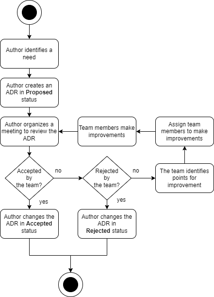

# ADR GEN 0003. Proceso de adopción de un documento ADR

Date: 2024-02-21

## Keywords

adr, log, decisión, registro, documento, proceso, adopción, creación.

## Status

Accepted

References [ADR GEN 0002. Formato usado en el documento ADR](GEN-0002-formato-usado-en-el-documento-adr.md)

## Context

La implementación de un proceso organizado para la creación de un documento ADR es crucial para garantizar la coherencia, la calidad y la efectividad en la toma de decisiones de Arquitectura. Un proceso estructurado ayuda a los equipos a atravesar las diferentes fases de manera sistemática y a capturar de manera integral la información necesaria. 

## Decision

Emplearemos el siguiente proceso para la generación y la adopción de un documento ADR:

Cualquier miembro del equipo puede iniciar la creación del documento ADR, identificando la necesidad de tomar una decisión de Arquitectura. Sin embargo, el equipo es el responsable de su propiedad. Cualquier cambio en el contenido del documento, previo a su aceptación, debe ser acordado con el Autor de dicho documento ADR.  

Finalmente, el documento aceptado debe ser cambiado al estado "Accepted" y la gestión de su ciclo de vida pasa a ser responsabilidad del equipo.

## Consequences

La falta de un proceso estructurado para la adopción de las decisiones de Arquitectura puede acarrear diversas consecuencias negativas para el equipo de Arquitectura. Algunas de las posibles consecuencias son:

**Falta de Claridad**: La ausencia de un proceso puede resultar en la falta de claridad sobre las acciones a seguir a la hora de construir los documentos que representan las decisiones de Arquitectura. Esto podría generar malentendidos y confusiones dentro del equipo.

**Pérdida de Conocimiento**: La rotación de personal o la inclusión de nuevos miembros en el equipo pueden resultar en la pérdida de información acerca del proceso empleado en la creación de los ADRs. 

**Riesgos de Calidad**: La falta de un proceso puede dar lugar a decisiones apresuradas, lo que podría afectar a la calidad de las decisiones.

