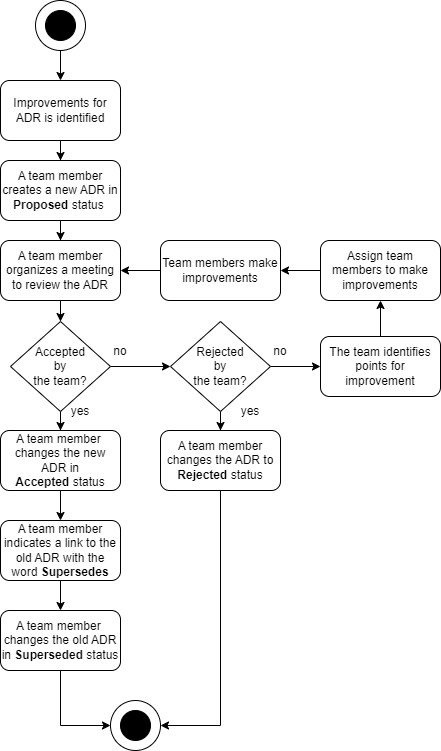

# ADR GEN 0004. Proceso de revisión de un documento ADR

Date: 2024-02-21

## Keywords

adr, log, decisión, registro, documento, proceso, revisión.

## Status

Accepted

References [ADR GEN 0002. Formato usado en el documento ADR](GEN-0002-formato-usado-en-el-documento-adr.md)

## Context

La implementación de un proceso organizado para la revisión de un documento ADR es crucial para garantizar la coherencia, la calidad y la efectividad en la toma de decisiones de Arquitectura. 

## Decision

Emplearemos el siguiente proceso de revisión de un documento ADR:

Los cambios en un documento ADR existente requieren que se cree un ADR nuevo, se establezca un proceso de revisión para el ADR nuevo y se apruebe el ADR. Si el equipo aprueba el ADR nuevo, el miembro del equipo debe cambiar el estado del ADR anterior al estado "Superseded". Luego, el nuevo documento ADR debe ser cambiado al estado "Accepted". Finalmente, debe establecer una referencia al documento que reemplaza con la palabra "Supersedes".

## Consequences

La falta de un proceso estructurado para la revisión de las decisiones de Arquitectura puede acarrear diversas consecuencias negativas para el equipo de Arquitectura. Algunas de las posibles consecuencias son:

**Falta de Claridad**: La ausencia de un proceso puede resultar en la falta de claridad sobre las acciones a seguir a la hora de revisión de los documentos que representan las decisiones de Arquitectura. Esto podría generar malentendidos y confusiones dentro del equipo.

**Pérdida de Conocimiento**: La rotación de personal o la inclusión de nuevos miembros en el equipo pueden resultar en la pérdida de información acerca del proceso empleado en la revisión de los ADRs. 

**Riesgos de Calidad**: La falta de un proceso puede dar lugar a decisiones apresuradas, lo que podría afectar a la calidad de las decisiones.

