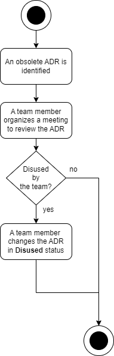

# ADR GEN 0005. Proceso de obsolescencia de un documento ADR

Date: 2024-02-22

## Keywords

adr, log, decisión, registro, documento, proceso, obsolescencia.

## Status

Accepted

References [ADR GEN 0002. Formato usado en el documento ADR](GEN-0002-formato-usado-en-el-documento-adr.md)

## Context

La gestión adecuada de la obsolescencia de documentos ADR es esencial para mantener la coherencia, la calidad y la efectividad en la toma de decisiones en el ámbito de la arquitectura.

## Decision

Emplearemos el siguiente proceso de obsolescencia de un documento ADR:

Cuando un ADR es identificado como obsoleto, el equipo no debe eliminar ese documento de su base de conocimiento, ya que al hacerlo perdería el historial y la información asociada con esa decisión. Luego, que el equipo acuerde su obsolecencia, el documento ADR debe ser cambiado al estado "Disused". 

Al marcar un ADR como "Disused" en lugar de eliminarlo, el equipo puede mantener un registro claro de las decisiones que se tomaron en el pasado, incluso si esas decisiones ya no son relevantes.

## Consequences

La falta de un proceso estructurado para abordar la obsolescencia de las decisiones de arquitectura puede tener varias consecuencias negativas para el equipo de arquitectura y en toda la organización. Algunas de las posibles consecuencias son:

**Falta de Claridad**: La ausencia de un proceso puede resultar en la falta de claridad sobre las acciones a seguir a la hora de abordar la obsolescencia de los documentos que representan las decisiones de Arquitectura. Esto podría generar malentendidos y confusiones dentro del equipo.

**Pérdida de Conocimiento**: La rotación de personal o la inclusión de nuevos miembros en el equipo pueden resultar en la pérdida de información acerca del proceso empleado en la obsolescencia de los ADRs. 

**Riesgos de Calidad**: La falta de un proceso puede dar lugar a decisiones apresuradas, lo que podría afectar a la calidad de las decisiones.

