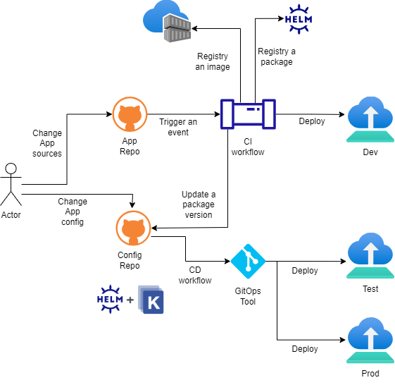

# ADR GITOPS 0008. Método de despliegue iniciado por CI y adueñado por GitOps

Date: 2024-03-11

## Keywords

gitops, devops, configuración, flujo, trabajo, workflows, CI, CD, pipeline.

## Status

Accepted

References [ADR GITOPS 0003. Estado del sistema reconciliado en intervalos de tiempo](GITOPS-0003-estado-del-sistema-reconciliado-en-intervalos-de-tiempo.md)

References [ADR GITOPS 0005. Almacenamiento de la configuración de la aplicación por separado de su código](GITOPS-0005-almacenamiento-de-la-configuracion-de-la-aplicacion-por-separado-de-su-codigo.md)

## Context

Las prácticas de CI/CD han sido diseñadas para mejorar los procesos de desarrollo y de entrega. Por un lado, la práctica de "Integración Continua" (CI) tiene como meta integrar cambios de código en un repositorio. Mientras que, la práctica de "Despliegue Continuo" (CD) tiene como objetivo automatizar el despliegue a varios ambientes. Si bien, ambas prácticas parecen estar fuertemente enlazadas, comenzaron a desacoplarse con el surgimiento de las prácticas de GitOps, haciendo que el proceso de GitOps desconozca lo realizado en el proceso de CI.

En este nuevo escenario, la forma de implementar los flujos de trabajo (pipelines) que involucran a ambas prácticas presentan desafíos.

## Decision

Emplearemos un modelo de flujos de trabajos en los cuales, el despliegue es inciado por CI y gestionado asincrónicamente por GitOps.

La CI es un proceso sincrónico que tiene un comienzo, generalmente desencadenado por algún evento (por ejemplo, un commit con un repositorio), con un conjunto de actividades o fases (construir la aplicación, ejecutar pruebas, armar la imagen y desplegar en un registro).

GitOps, como mecanismo de CD, es un proceso asincrónico. Como se indicó, en el [ADR GITOPS 0003](GITOPS-0003-estado-del-sistema-reconciliado-en-intervalos-de-tiempo.md) realiza la sincronización del "estado real" del sistema con su "estado deseado" a intervalos de tiempo regulares.

En el modelo elegido, la plataforma de CI que crea la aplicación y deja que la herramienta de GitOps sincronice la implementación de forma asincrónica. Una vez que la herramienta GitOps completa la implementación puede generar un evento para lanzar un flujo de tarea posterior.

A continuación, se muestra un flujo de trabajo CI/CD de alto nivel usando GitOps con un repositorio de configuración y un repositorio de código fuente separado:

## Consequences

Al implementar este modelo, se desacopla el flujo de trabajo de CI y el flujo de trabajo de CD, permitiendo que ambos evolucionen independientemente, eliminando la necesidad de disponer de estrategias de integración entre ellos.

En este flujo de trabajo se combinan las prácticas de "Integración Continua" y GitOps para el desarrollo y la implementación de aplicaciones.

El proceso CI requiere, al finalizar la construcción de la aplicación, crear una solicitud de cambio (Pull Request/Merge Request) o aplicar un cambio directo (commit) sobre los entornos (desarrollo, testing y producción) almacenados en el repositorio de configuración y monitoreados por la herramienta de GitOps.

