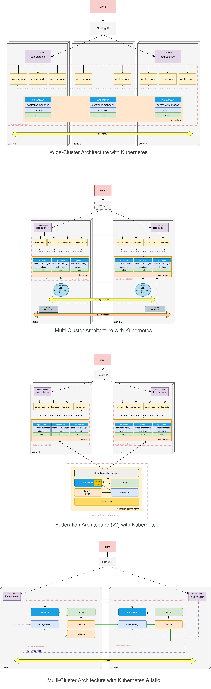

# ADR MULTIPLE-K8S 0002. Uso de soluciones de multiples clusteres de kubernetes

## Keywords

redundancia, multi-cluster, alta disponibilidad, kubernetes.

## Status

Accepted

## Context

Existen varias opciones de despliegue que permiten que el clúster de kubernetes se ejecute en varios centro de datos garantizando la alta disponibilidad de los servicios soportados en la plataforma. Entre las posibles alternativas tenemos: wide-cluster, multi-cluster con kubernetes, multi-cluster con malla de servicios y federación.

Además, es posible clasificar esas alternativas de despliegues en Activa-Activa y Activa-Pasiva. En la solución Activa-Activa se distribuye la carga entre las partes redundantes mientras que, en la solución Activa-Pasiva se mantiene sincronizada la parte Pasiva (solo funciona ante falla de la parte Activa), resolviendo todo el tráfico en la parte Activa.

## Decision

Usaremos la alternativa de despliegue Activa-Activa basada en multi-cluster con malla de servicios o federación.

La solución Activa-Pasiva de multi-cluster con kubernetes implica que sus recursos estarán a la espera para manejar la carga de trabajo si el clúster principal falla totalmente. Sin embargo, no permite que la falla de servicios individuales en el clúster principal pueda ser derivada al clúster secundario, provocando un ineficiente uso de los recursos.

La alternativa wide-cluster es una solución que permite distribuir los servicios de kubernetes entre varios centro de datos de forma barata y de fácil administración. Sin embargo, solo se tiene un clúster y como consecuencia un único punto de falla, ya que si ese clúster se rompe durante una actualización o un cambio de configuración (falla configuración componente CNI) se afectaran sus servicios. También, no posibilita el crecimiento del clúster, ya que existen límites teóricos para el tamaño de un clúster.

Las alternativas de multi-cluster con malla de servicios o federación permiten una solución Activa-Activa aprovechando un uso eficiente de los recursos, se distribuye la carga entre los clústeres de la solución, mayor tolerancia a actualizaciones o cambio de configuraciones de los clústeres y es más resistente debido a su arquitectura distribuida (la falla en un clúster redirige el tráfico hacia otros clústeres). 

Alternativas de topologías clusteres de alta disponibilidad:

## Consequences

El uso de las alternativas de multi-cluster con malla de servicios o federación tiene una infraestructura mas compleja lo que requiere sincronización entre los clústeres y un componente que coordine las operaciones entre los clústeres.

Son soluciones más caras.
