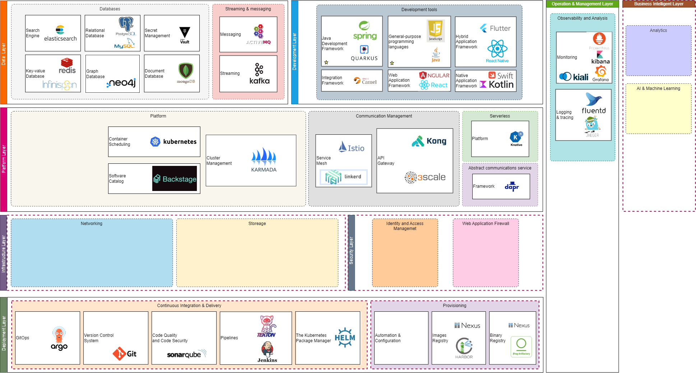
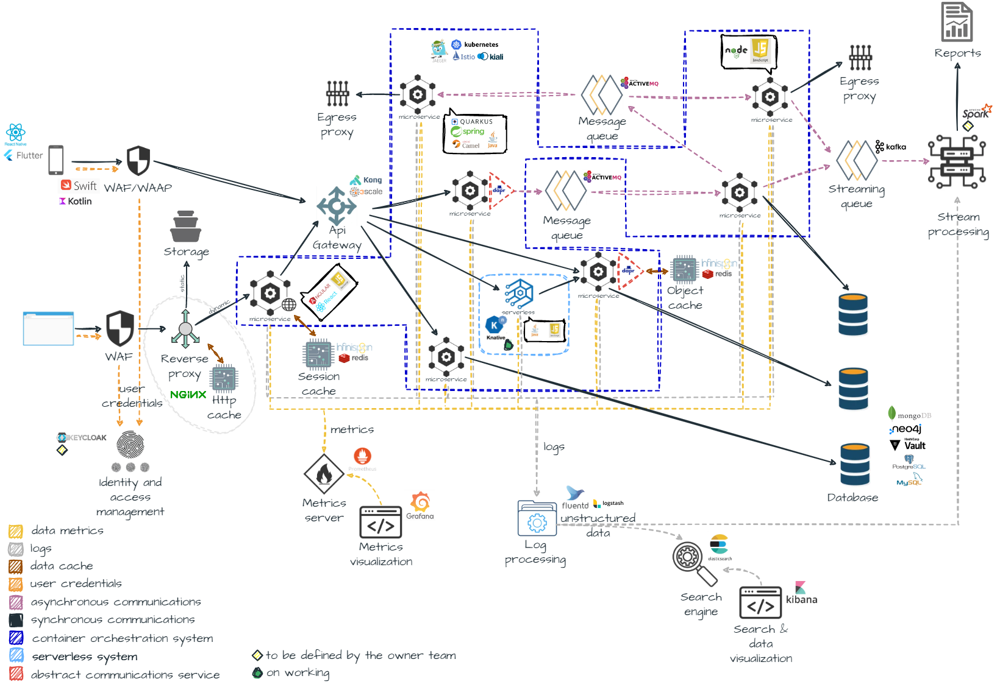

# ADR PLAT 0001. Ecosistema de servicios tecnológicos utilizados para construir una aplicación en la nube

## Keywords

ecosistema, plataforma, servicio, tecnológicos, aplicación, nube.

## Status

Accepted

## Context

La construcción de aplicaciones modernas requiere descomponer las mismas en servicios tecnológicos que serán empleados en sus desarrollos. Estos servicios tecnológicos definen el ecosistema que incluyen lenguajes de programación, los frameworks, las plataformas y las herramientas que un desarrollador necesitaría para construir y ejecutar las aplicaciones. Además, son útiles para definir el perfil requerido de los equipos y, conocer las fortalezas y debilidades de la aplicación, ya que cada servicio posee beneficios y limitaciones.

## Decision

Usaremos el ecosistema de servicios tecnológicos definido en la siguiente imagen:

El diagrama anterior refleja una vista sobre la cual podemos descomponer el problema del desarrollo de aplicaciones modernas. Este diagrama se divide en capas horizontales y verticales, las cuales están divididas en categorías y subcategorías.

Cada una de las capas representan el foco del problema que se está atacando. Las capas horizontales reflejan cierto grado de dependencia mientras que, las capas verticales se expanden en múltiples capas.

Las subcategorías incluyen herramientas o tecnologías que ayudan a resolver el problema en cuestión.

Las capas están divididas en:

Deployment: Esta capa incluye herramientas de soporte usadas durante la construcción de aplicaciones modernas. Estas herramientas ayudan a gestionar el código, generar imágenes de contenedores y realizar su despliegue de una manera estándar y automatizada. Su intención de acelerar o simplificar el entorno de desarrollo y la entrega continua de valor a los clientes.

Infrastructure: Esta capa contiene tecnologías que brindan recursos a las restantes capas, permitiendo correr sus servicios, es decir, sin los servicios o recursos ofrecidos por esta capa es imposible la ejecución de los restantes servicios.

Platform: Esta capa ofrece herramientas que asisten a los desarrolladores en la construcción de aplicaciones modernas. Las herramientas de esta capa se enfocan en dar soporte a la lógica del negocio. Estos servicios ayudan a ejecutar las aplicaciones en un clúster o en múltiples clústeres, controlar la salud de las aplicaciones, permitir que las aplicaciones se adapten a la carga, organizar los servicios ofrecidos por las aplicaciones, autorizar o limitar la cantidad de solicitudes que reciben. Y finalmente, agregar funciones de confiabilidad, observabilidad y seguridad sin tocar el código de las aplicaciones. Su intención es que los desarrolladores se enfoquen en lo que realmente importa, construir código de negocio.

Data: Esta capa dispone de tecnologías que permiten a las aplicaciones modernas acceder, almacenar o comunicar información. Estas herramientas ayudan a almacenar y recuperar datos de manera eficiente, garantizando que solo los usuarios autorizados puedan hacerlo. Además, permiten el intercambio de información, mediante mensajes, entre las aplicaciones que necesitan comunicarse. Su intención es controlar y gestionar el intercambio de datos o información entre las aplicaciones.

Development: Esta capa ofrece herramientas que ayudan a los desarrolladores en la construcción de las aplicaciones modernas. Su intención es permitir a los desarrolladores poner foco en construir código de negocio.

Operation and Management: Esta capa ofrece herramientas que ayudan al análisis y la observabilidad de las aplicaciones modernas. Son herramientas que ofrecen funciones para ayudar a las aplicaciones a describir su estado (el tiempo de CPU, la memoria, el espacio en disco, la latencia, los errores, etc.) y así, recopilar y analizar sus registros y sus métricas para mejorar nuestra comprensión de su comportamiento. Su intención es permitir la comprensión del funcionamiento de las aplicaciones para así poder mejorar su soporte o diagnosticar cualquier inconveniente con suficiente antelación.

Security: Esta capa contiene tecnologías que ayudan a proteger los activos digitales.

Business Intelligent: Esta capa contiene tecnologías que permiten analizar datos y brindar información para ayudar a los ejecutivos o a los analistas del negocio a tomar decisiones comerciales.

En el siguiente diagrama se puede observar el uso de los servicios tecnológicos empleados en una solución de ejemplo que requiere servicios ofrecidos en la web y en plataforma móvil:

## Consequences

El conocimiento del ecosistema de servicios tecnológicos utilizados ayuda a entender cuales herramientas se deben utilizar en el desarrollo de aplicaciones modernas y a comprender el perfil requerido de los equipos en su contratación. Sin embargo, es importante considerar que presenta varios desafíos:

- Conocer el alcance de los servicios para no otorgarle mas responsabilidades de las que dispone.
  
- Comprender las fortalezas y las debilidades de cada servicio para saber cuando se debe aplicar uno u otro.
  
- Mayor diversidad de servicios hace mas compleja su administración.
  